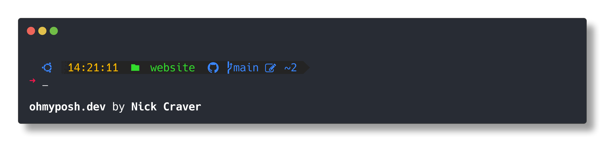

## 前言

[oh-my-posh](https://ohmyposh.dev/)是一款跨平台，跨shell的prompt，[starship](https://starship.rs)也是。

最近一年多一直在用oh-my-posh，那么近期为什么放弃了oh-my-posh而使用starship呢？

原因在于：oh-my-posh在PowerShell和MSYS2 + zsh的环境里速度太慢了，前者终端加载要接近两秒甚至更多（PowerShell本来就是乌龟速度），后者按回车换行都有明显卡顿。

再之前一直用powerlevel10k，但是用久了觉得不好看，也没那么容易配置，于是除了MSYS2外的环境都切到了oh-my-posh。

最近几个月经常看到starship，前几天就统一切到starship了。

和oh-my-posh相比，有一些功能差一些，也有一些功能比oh-my-posh强。

## Oh-My-Posh

Oh-My-Posh提供了非常多的[预制主题](https://ohmyposh.dev/docs/themes)，这一点完爆starship。

我使用的主题是基于craver改的：



改良后：


变化不大，命令执行时间的segment的两侧边界改了改，os图标的背景改成了更浅的颜色，同时把transient_prompt打开，让历史的prompt只显示一个图标，简洁了很多。

但是这个改动，讲道理没那么好改，因为配置文件是拿json做的，一大片的json写起来就……幸好只是基于现有的配置稍作修改，不是完全写的一个全新的。

优点是，omp的配置可以在json里写逻辑，加载的时候会自动做处理，比如以下配置：

``` json
{
    "background": "#0184bc",
    "foreground": "#ffffff",
    "powerline_symbol": "\ue0c4",
    "style": "powerline",
    "template": " \ue70c {{ if .Unsupported }}\uf071{{ else }}{{ .Full }}{{ end }} ",
    "type": "dotnet"
},
```

里面包含if和else，一定程度上有lua内味了。**可以写逻辑的配置文件吊打不能写逻辑的。**

还有一些细节完爆Starship：

* OS图标比Starship多很多，很多linux发行版都加了判断和图标，Starship目测……只有OMP的一半吧，虽然够用，但是只有一半。
* OMP的git的上游，根据远程不同有不同的图标，普通git是一个图标，github是github的图标，gitlab是gitlab的图标，这功能Starship里没有。而且toml能写逻辑吗？Starship如果没做扩展的话就实现不了这种功能。
* 支持transient promp，刚才也提到了，可以分别设置当前行的prompt样式和历史行的样式，看起来就是图片中，只有光标那一行最新的prompt是完整的，再往上的prompt除了显示命令以外prompt就只有一个图标，这个功能starhip并没有原生支持。

从这些角度来讲，并不能说Starship完爆OMP。

[完整配置](https://github.com/realth000/config/blob/master/015-oh-my-posh/craver_self.omp.json)

## Starship

Starship拿最人性化的toml来做配置，好写很多，而且文档介绍segemnts非常全面，也有示例。

因为OMP自用主题用久了，也想用一样的配置，写起来不难。

最终结果是这样的：


相似度90%，不同的地方在于命令执行时间的边界处理得很粗糙，同时也没有transient prompt。

新加了git commit hash，体验不错。

[完整配置](https://github.com/realth000/config/blob/master/026-starship/starship.toml)

作为配置文件，toml比json优雅多了，可以写注释（json5就不要提了），分段也更清晰。

Starship比OMP新增了什么功能呢？

* 多行的命令，第二行开始可以有一个prompt char，但是这个不能说是加强吧，只能说好看一点。如果要复制这个多行命令，就会把这个行首的多余字符复制进去，多少有点nt，但是这种时候并不多所以我还是没去掉。
* sengemnts介绍更友好吧，常用的数量比OMP多，尤其是git。其实我并不在意能不能提供某种语言或者框架的版本这种信息，在没有使用virtual env的情况下显示那玩意就是画蛇添足，不如多来点git信息，实实在在减少出错。我不确定OMP有没有这个配置。
* 然后就是更快了，平常体现不出来，在powershell和MSYS2里优势很明显，也多亏这俩玩意性能太烂。~~其实是应该趁早放弃垃圾Windows~~

## 总结

单论配置文件，json写起来麻烦，但是OMP做了扩展，里面可以加上逻辑，Starship的toml只是普通的toml，似乎不能写逻辑。

总体来说，OMP和Starship并没有谁完全比谁强，在Powershell和MSYS2里，Starship的优势很明显，但是在其他环境里，OMP确实更舒心。

如果偷懒，就统一用Starship，如果想更美观，可以两个都用。

要我选的话，标题不就说了嘛，从Oh-My-Posh到Starship。~~不能写注释的json不应该作为配置文件~~
